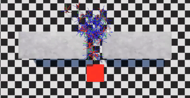
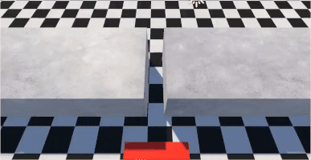

# Crowd Kinetic, version .01

This repository contains implementation of rigid body agent-based crowd simulation framework utilizing simplified ray casting social forces and heat map parameters fitting.

We hava prepared several experiments based on real data from [New insights into pedestrian flow through bottlenecks](https://arxiv.org/abs/physics/0702004). Results can be evaluate using Python script [crowd_forces.py](crowd_forces.py).

Below there are two example visualizations for bottleneck experiment with various width of the corridor based on [real-world data](https://ped.fz-juelich.de/db/doku.php?id=bottleneck2) and theoretical scenario with 500 agents devided into two groups.

Crowd Kinetic has advanced Unity Editor that enables castomization of simulation enviroment including defining groups of agents with different goals and parameters, random or file-based initialization, real-time parameters tuning and many, many more. 

## Technical details

Tested on Unity 2021.3.11f1 and later versions. 

Crowd Kinetic is build on the top of Unity [AI Navigation](https://docs.unity3d.com/Packages/com.unity.ai.navigation@2.0/manual/index.html), however it is used only for path finding. All other funcionalities are implementation of [Social Force Model for Pedestrian Dynamics](https://arxiv.org/abs/cond-mat/9805244) algorithm adapted for rigid bodies and ray casting-based neighborhood analysis.  

3D models and animations were generated with [Mixamo](https://www.mixamo.com/).

